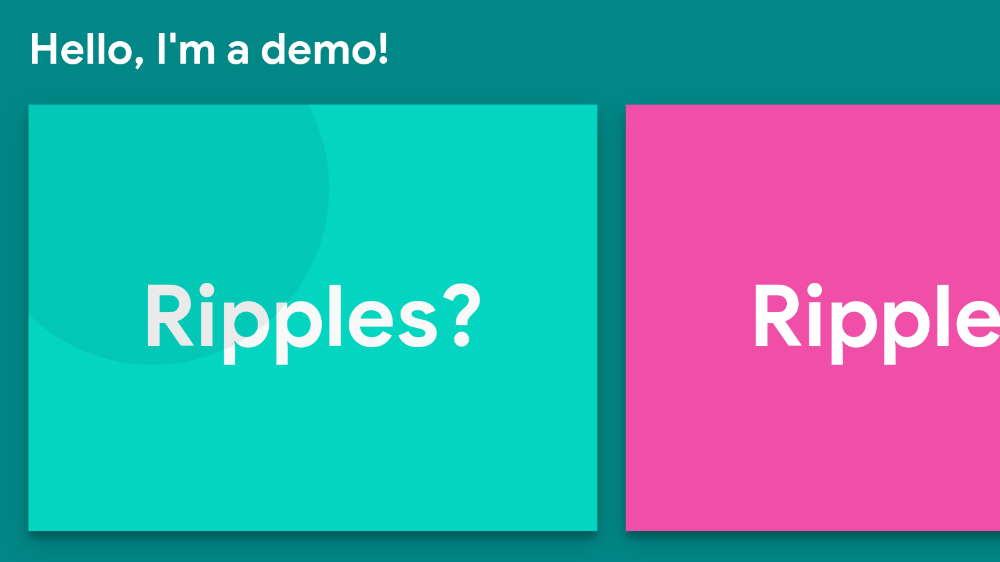

[][Demo]

# RippleTouch

> Touch with a ripple | ES6 Module

 

Ripple, ripple, ripple. A ready-to-use, no cofiguration needed web component for modern browsers. **7.09kb** (v7.1478, unzipped) in total, JSDoc written, it's **fast** and **elegant**. That's it.

### Index 😃

- [Example](#example)
- [Usage](#usage)
- [Configuration](#configuration)
- [Notes](#notes)
- [Support](#support)
- [License](#license)

---

## Example

Click the image above or [here][Demo] to see the demo. Typical code:

```html
<div class="ripples" style="background: #03dac5;" Ripple>
  Ripples?
</div>
```

and script (dynamic import):

```javascript
let Ripple;
import('./Modules/Ripple.js')
  .then((module) => {
    Ripple = module.default;
    Ripple.load();
  });
```

## Usage

Preparation: [Click here to download](https://github.com/PaperFlu/RippleTouch/releases/latest/download/RippleTouch.zip) the latest **RippleTouch.zip** asset directly, or go to [the release page](https://github.com/PaperFlu/RippleTouch/releases) to choose another version of it.

### Install

First, extract **Ripple.js** to wherever you want.

Second, add attribute `[Ripple]` to select the elements which has the effect. Example:

```html
<button Ripple>Boom Shakalaka</button>
```

Finally, import it from where you extracted it and call `Ripple.load`. The module will import CSS to `document.body` automatically when call the load. For standard import method using static `import` statement, **remember** to give the \<script\> a `type="module"`, otherwise the `import` statement will be unusable.

```javascript
// <scrip src="example.js" type="module"></script> in example.html
// Below is example.js
import Ripple from './Modules/Ripple.js';
Ripple.load();
```

or use a function-like dynamic `import()` like the [example](#example) does. It's **[recommended](#use-dynamic-import)**. `type="module"` is needless there. Done. 😉

### Update

Extract the latest achieve to where you stored **Ripple.js** and overwrite it. In most cases, it's done.

Update from **v6** or below? Delete **Ripple.css** as it has been integrated with the script since **v7**.

## Configuration

Unnecessary but well-tested adjustments.

### Limit Scope

Post an element to `Ripple.load` after importing the module:

```javascript
// ... (Imported Ripple object)
const earth = document.getElementById('earth');
Ripple.load(earth);
```

Elements outside `earth` will have **no ripple effects** even if it has a `[Ripple]` attribute. RippleTouch uses event listeners to set up effects, and the listeners will be added to the element specified. If **no** element been posted, `document.body` will take its place.

Limiting scope may improve performance because outside it will not examine whether the element user interacted has `[Ripple]` or not anymore. You can use `Ripple.load` many times to extend scope for different parts of your page. But usually, a single execution without parameter is totally enough.

### Avoid variable conflicts

`[Ripple]` identity can be changed. If other HTML or CSS use the same word, change it **before the first run of `Ripple.load`** may avoid unexpected behavior. Example here:

```javascript
// ... (Imported Ripple object but executed Ripple.load)
Ripple.markWord += Math.floor(Math.random() * 10 ** 10).toString();
Ripple.load();

// Turn some elements to a lake.
const buttons = document.getElementsByTagName('button');
buttons.forEach((ele) => ele.setAttribute(Ripple.markWord, ''));
// ...
```

### Others

These (currently only one) can be changed by `Ripple.set` **at anytime**:

```javascript
settings = {
  initialScale: 0.6,
};
```

-   At the **beginning** of the animation, the diameter of ripple is **60% of the longer** between the width and height in default. If I want it smaller:
    ```javascript
    Ripple.set({ initialScale: 0.3 });
    ```

## Notes

Suggestions and imperfections in the latest release.

### Use dynamic import

If you use static `import` statement to import modules, you will be **UNABLE** to access them outside the \<script\> marked `type="module"`. So, in my *personal* views, use dynamic import always if there is no need to consider such a small browser compatibility difference. (For example, Chrome leaves 61-63 and Firefox leaves 60-67 away, according to [MDN](https://developer.mozilla.org/en-US/docs/Web/JavaScript/Reference/Statements/import#Browser_compatibility).)

Ignore it if you use tools like [Babel](https://babeljs.io).

### Only change Ripple.markWord before load

Stylesheets will be generated and appended to `document.body` with `Ripple.markWord` at the first execution of `Ripple.load`.

Changing the word afterwards seems meaningless. So the markWord is **forced unwritable** once `Ripple.load` executed.

```javascript
Ripple.markWord = 'Ripple1683247813';
Ripple.load();

// Will not change.
// At strict mode, throws a TypeError:
// "markWord" is read-only.
// And will not change, either.
Ripple.markWord = 'Ripple2347119623';
```

### One ripple at a same time

Haven't been well-adjusted for mobile devices.

- Events will be delayed about 300ms if users have options like "`force enable zoom`" enabled in browsers, which makes the web page being felt laggy.

- It can only make **one** ripple at a same time. Use two fingers touch at the two blocks in the [demo][Demo], you will get it. There isn't a plan to fix it for now.

## Support

Issues will be opened soon. 😛

## License

[Apache 2.0](http://www.apache.org/licenses/LICENSE-2.0)

[Demo]: https://paperflu.github.io/RippleTouch